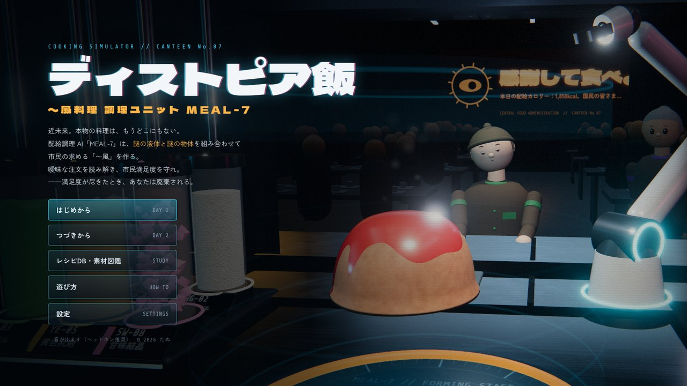
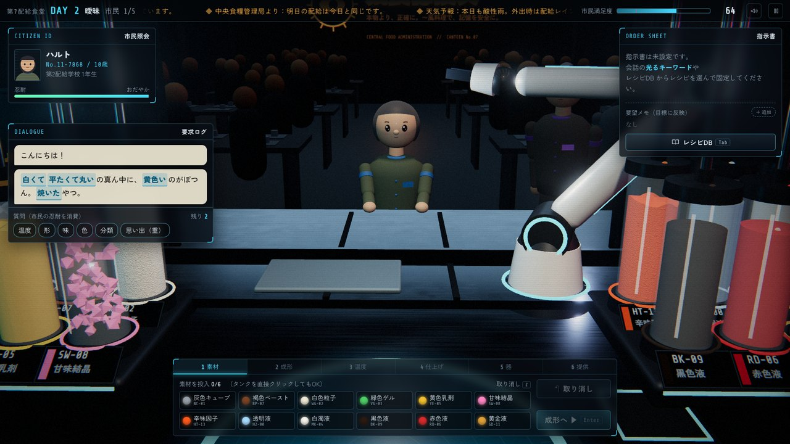
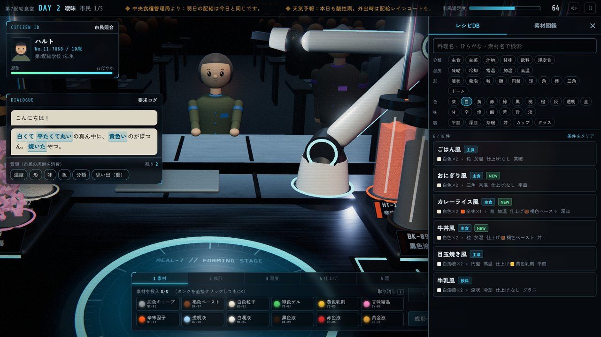
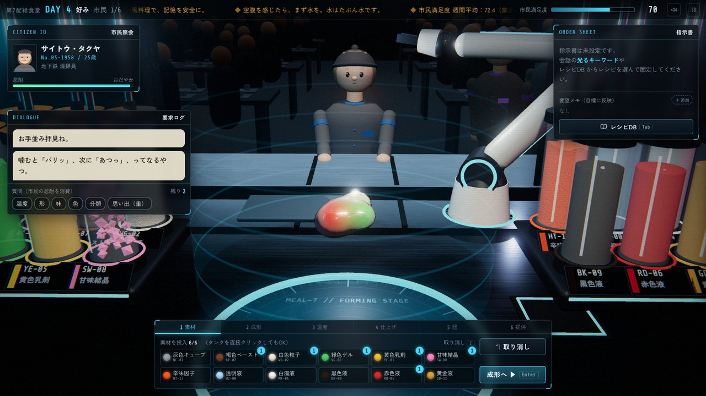
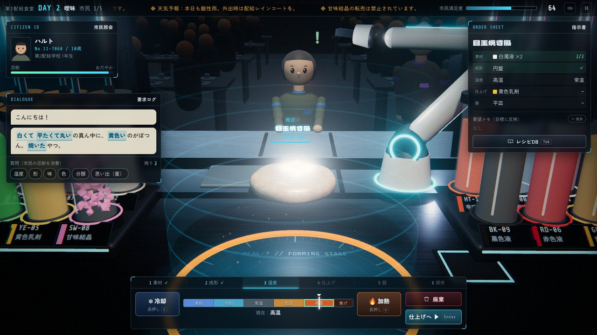
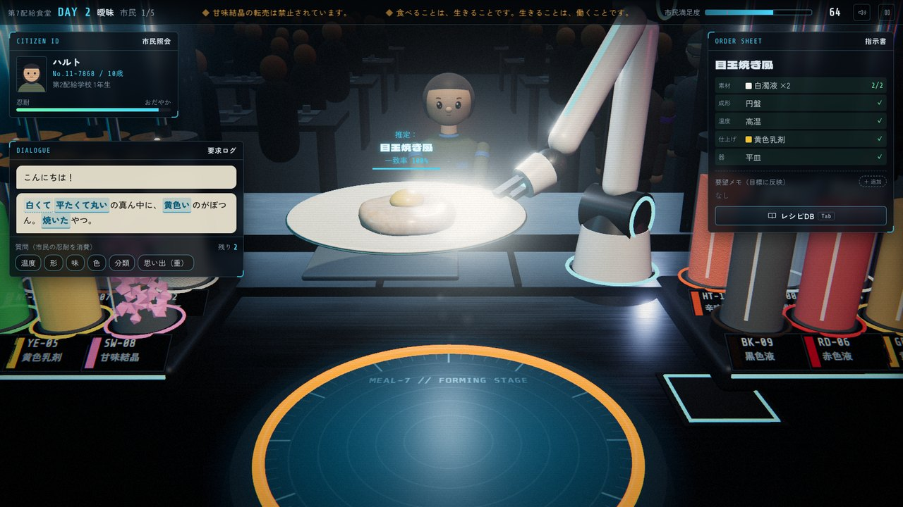
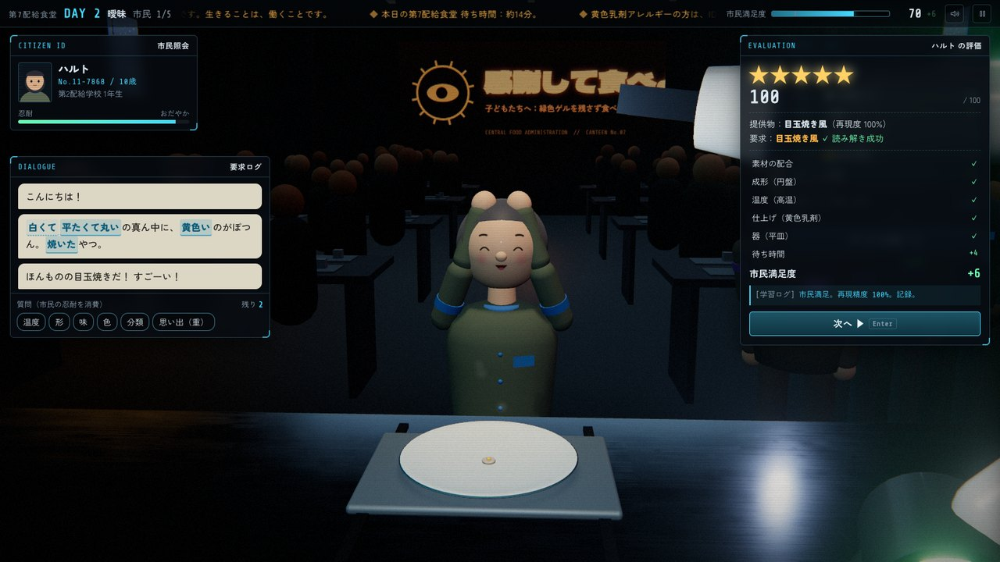
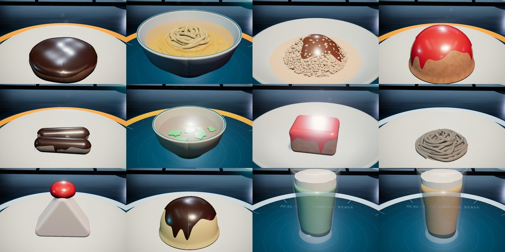
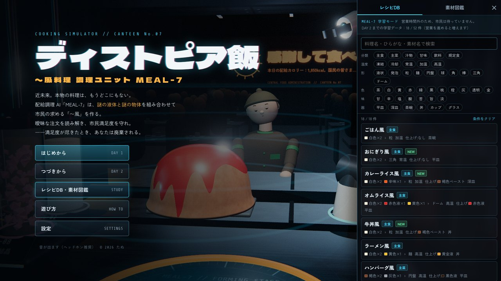

# ディストピア飯 — COOKING SIMULATOR



**▶ ブラウザで遊ぶ：https://tanuu5.github.io/dystopia-meshi/**

近未来。本物の料理は、もうどこにもありません。
あなたは第7配給食堂の調理 AI「MEAL-7」。市民の曖昧な注文を読み解き、12 種類の**謎の液体と謎の物体**を組み合わせて「〜風」の料理を作り、提供します。

市民は食べて評価します。評価が悪すぎて**市民満足度が 0 になると、MEAL-7 は廃棄処分**です。

- ブラウザで動く 3D クッキングシミュレーターです（Three.js / WebGL2）。PC のブラウザ推奨
- 画像・音声ファイルは使っていません。厨房・市民・料理はすべて手続き的なジオメトリとシェーダー、音は Web Audio で合成しています
- このゲームは **Claude Opus 5.5（MAX）で作成**しました

## スクリーンショット

| | |
| --- | --- |
|  |  |
| 注文は曖昧。光るキーワードが手がかり | キーワードを押すとレシピDB が絞り込まれる |
|  |  |
| 謎の素材が反重力場で混ざり合う | 形を決めて、温度を合わせる |
|  |  |
| アームが器の縁を持って配膳する | 市民が食べて ★1〜5 で評価 |



ハンバーグ風、ラーメン風、カレーライス風、オムライス風、焼き魚風、味噌汁風、麻婆豆腐風、ざるそば風、ショートケーキ風、プリン風、クリームソーダ風、ビール風……レシピは全 52 種。

## 遊び方

1. **注文を読み解く** — 市民は料理名をはっきり言うとは限りません。「白くて平たくて丸いの真ん中に、黄色いのがぽつん」「誕生日にだけ出てきた、ナイフを入れるとじゅわっとするやつ」。会話の光るキーワードを押すと、レシピDB がその条件で絞り込まれます。DAY 2 からは「質問」（温度・形・味・色・分類・思い出）で手がかりを増やせます（市民の忍耐を消費）。
2. **指示書に固定する** — レシピDB で「〜風」を選んで固定すると、右上の指示書に配合と進み具合（✓）が表示されます。「辛めで」「猫舌」などの要望は要望メモに入れると目標に反映されます。
3. **調理する** — 6 つの工程で作ります。
   | 工程 | 内容 |
   | --- | --- |
   | 素材 | 12 種のタンクから最大 6 単位を投入（タンクを直接クリックしても可）。反重力場の中で混ざり合う |
   | 成形 | 液状・発泡・粒・麺・円盤・球・角・棒・三角・ドーム の 10 種 |
   | 温度 | 🔥加熱／❄冷却を長押し。凍結・冷却・常温・加温・高温。行き過ぎると焦げる |
   | 仕上げ | 上からかけるソース・スープ・泡など（素材のどれか 1 つ、またはなし） |
   | 器 | 平皿・深皿・茶碗・丼・カップ・グラス。アームが盛り付ける |
   | 提供 | アームが器を持って配膳口のトレイへ。市民の前へ滑っていく |
4. **評価** — 市民が食べて ★1〜5 で評価し、市民満足度が上下します。作ったものが別の料理に見えれば「これ…〇〇じゃない？」と言われます。

### 営業時間外の予習（レシピDB・素材図鑑）



営業中にレシピDB を読んでいると、そのあいだも市民は待っています（のんびりモードを除く）。タイトル画面の「レシピDB・素材図鑑」を開くと、営業時間外の**学習モード**として時間を気にせず読めます。載っているのは「つづきから」遊ぶ日までに学習したレシピで、その日に増えるレシピには NEW が付きます。

### 7 日間の試験運用

| 日 | 内容 |
| --- | --- |
| DAY 1 起動 | チュートリアル。料理名ではっきり注文される |
| DAY 2 曖昧 | 特徴や思い出で注文される。質問が使えるようになる |
| DAY 3 配給制限 | 素材の欠品（代替配合）と、市民の好み（辛め・甘め・大盛り…） |
| DAY 4 好み | ID カードのアレルギー、猫舌、熱々 |
| DAY 5 監査 | 管理局の監査官（評価が 2 倍）。レシピDB に無い料理の注文も |
| DAY 6 記憶 | 旧時代の記憶に基づく注文が増える |
| DAY 7 最後の注文 | 常連たちとの最後の一日 |

常連の市民（元・定食屋のおじいさん、絵本の料理にあこがれる女の子、夜勤明けの工員、元・料理研究家、刺激物を求める謎の男、監査官）にはそれぞれの物語があります。7 日間を終えると評価に応じたエンディングになり、その後は「エンドレス営業」を続けられます。

### 操作

| 操作 | キー |
| --- | --- |
| レシピDB を開く／閉じる | `Tab` |
| 次の工程へ・提供・会話を進める | `Enter` |
| 素材の取り消し | `Z` |
| 冷却／加熱（長押し） | `A` / `D`（または ← / →） |
| 一時停止 | `Esc` |
| 消音 | `M` |

設定で「のんびりモード」（市民が帰らない）、文字の速さ、画質、音量を変えられます。進行は日ごとにブラウザ（localStorage）へ保存され、タイトルの「つづきから」で再開できます。

## 動かし方

Node.js 22.18 以降が必要です。

```bash
npm install
npm run dev
```

表示された URL（既定では `http://127.0.0.1:5192`）をブラウザで開きます。

本番用のファイルを作るには:

```bash
npm run build
```

`dist/` に静的ファイルが出力されます（相対パスなので GitHub Pages などにそのまま置けます）。このリポジトリでは、`main` ブランチに push すると GitHub Actions がビルドして GitHub Pages に公開します（`.github/workflows/deploy.yml`）。JS と CSS を 1 つの HTML にまとめた版は `npm run build:single` で `dist-single/` に出力されます。

型の検査と、レシピ同士が紛らわしすぎないか・注文文の書式が正しいかの検査は次のコマンドでできます。

```bash
npm run typecheck
npm run check:recipes
```

## 技術構成

- [Three.js](https://threejs.org/) r186（WebGLRenderer）、TypeScript、Vite
- ポストプロセス：UnrealBloom、自前の最終パス（色収差・ビネット・走査線・フィルムグレイン・警報・グリッチ）
- 混ざり合う素材：マーチングキューブのメタボール（色を重みで正規化して自前で書き込み）
- 料理：成形ごとの手続き的ジオメトリ。焼き色・焼き網の跡・焦げ・霜はシェーダーで加え、ソースは本体の形を膨らませてフラグメント単位で縁を切り抜く。食べ進むと、汁は器の内側の形に沿って減る
- 市民：プリミティブの組み合わせ＋キャンバスに描いた表情テクスチャ（まばたき・口パク・喜怒哀楽）
- ロボットアーム：2 リンクの逆運動学＋球関節の手首。料理に触れないよう、皿や丼は縁を、カップ・グラス・茶碗は胴を挟んで運ぶ
- 音：Web Audio API による環境音・自動生成の BGM・効果音・市民ごとの声

## ファイル構成

```
src/
  Game.ts          ゲーム進行（1 日の流れ、注文、調理、評価、満足度、保存、チュートリアル）
  data/            素材・工程・レシピ（注文文つき）・要望・人物・日程・台詞
  sim/             採点、注文の生成、市民の反応
  scene/           描画（厨房、タンク、投入ヘッド、メタボール、料理、器、アーム、市民、食堂）
  ui/              HUD、会話、指示書、調理コンソール、レシピDB、各画面
  audio/           Web Audio の合成音
scripts/
  build-single.mjs 1 ファイル版の HTML を作る
  check-recipes.ts レシピの検査
screenshots/       この README の画像
```

## 制作

- 作者：たぬ
- 制作：Claude Opus 5.5（MAX）で作成

## ライセンス

MIT License © 2026 たぬ

three.js（MIT License）を使っています。フォント（Dela Gothic One / Zen Kaku Gothic New / Share Tech Mono）は Google Fonts から読み込んでいます（SIL Open Font License）。
